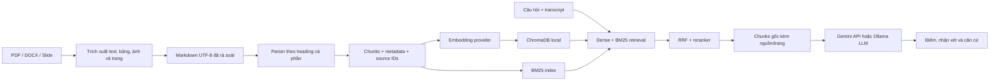

# Đề xuất RAG dùng Markdown cho QNU AI VIVA

**Ngày:** 26-09-2026  
**Phạm vi:** Kho tri thức giáo trình và tài liệu môn Công nghệ phần mềm; trả lời câu hỏi, cung cấp căn cứ chấm thi vấn đáp.  
**Khuyến nghị:** Giữ ChromaDB local và pipeline hybrid hiện có; bổ sung Markdown làm định dạng tri thức chuẩn, cải thiện metadata/chunking/ingestion. Dùng embedding local làm mặc định, Gemini API như một cấu hình thay thế có chủ đích. Ollama Gemma hiện có thể tiếp tục dùng để sinh câu trả lời.

## 1. Tóm tắt quyết định

| Thành phần | Lựa chọn đề xuất | Lý do |
| --- | --- | --- |
| Tài liệu chuẩn | Markdown UTF-8 trong `knowledge/` (hoặc `document_md/`) | Dễ rà soát, sửa, phân cấp tiêu đề và lưu Git; phù hợp tài liệu môn học đã biên tập. |
| Tài liệu nguồn | Giữ PDF/DOCX trong `document/`; không thay thế bản gốc | Có thể truy vết, đối chiếu trang và dựng lại Markdown khi cần. |
| Vector DB | ChromaDB persistent local hiện có | Đã tích hợp vào `rag_module.py`; lưu vector và metadata, hỗ trợ cosine/HNSW, đủ cho ứng dụng demo và corpus hiện tại. |
| Keyword search | Giữ BM25 + RRF hiện có | Thuật ngữ, chữ viết tắt, mã UML và từ khóa rubric thường cần khớp chính xác. |
| Embedding mặc định | Giữ `paraphrase-multilingual-MiniLM-L12-v2` ban đầu; đánh giá thêm embedding tiếng Việt/multilingual chạy local trước khi đổi | Không gửi tài liệu ra cloud, tương thích dữ liệu hiện tại; mọi lần đổi encoder cần tái lập chỉ mục. |
| LLM sinh câu trả lời/chấm | Gemini API cho chất lượng/độ trễ khi có mạng; Gemma qua Ollama cho chế độ local | Tách LLM sinh câu trả lời khỏi encoder truy xuất. Hai lựa chọn LLM có thể dùng cùng một kho vector. |
| Gemini embedding | Tùy chọn, không phải mặc định | Có ích nếu cần tìm kiếm đa phương thức thật sự; cloud dependency và đổi model kéo theo index mới. |

## 2. Đọc codelab và phần áp dụng được

Codelab Google minh họa quy trình nhiều phương thức: nạp PDF, tách nội dung văn bản/bảng/hình ảnh, tạo summary cho các phần, nhúng summary vào ChromaDB, rồi dùng `doc_id` để từ kết quả summary truy xuất nội dung gốc. Với nội dung hình ảnh, mô hình đa phương thức mô tả ảnh để truy xuất rồi gửi ảnh gốc và văn bản liên quan vào LLM.

Ý tưởng nên lấy cho dự án:

1. **Tách phần dùng để tìm kiếm khỏi phần dùng để làm căn cứ.** Có thể nhúng một đoạn Markdown đã chuẩn hóa/tóm tắt, nhưng kết quả phải trả về đoạn gốc với nguồn và trang.
2. **Metadata và định danh nguồn là một phần của pipeline.** Mỗi đoạn cần biết tài liệu, phần/chương, trang, đường dẫn và phiên bản.
3. **Bổ sung nhánh hình ảnh/bảng khi thực sự cần.** Giáo trình hiện có nhiều slide và PDF; biểu đồ UML, sơ đồ kiến trúc và bảng tiêu chí có thể mất thông tin nếu chỉ trích xuất text.

Cần điều chỉnh so với notebook codelab: ví dụ dùng các tên model Gemini/Vertex AI đời cũ và `InMemoryStore` cho tài liệu nguyên gốc. Dự án nên giữ bản gốc bền vững trên đĩa, dùng SDK/API đang được hỗ trợ tại thời điểm triển khai, và xác minh model/giới hạn mới nhất trước khi bật Gemini. Theo tài liệu Gemini hiện hành, `gemini-embedding-2` hỗ trợ embedding văn bản, hình ảnh, video, âm thanh và PDF; tuy nhiên PDF đầu vào tối đa 6 trang mỗi yêu cầu. Không nên gửi nguyên giáo trình dài như một PDF đơn vào một lần gọi embedding. [Codelab](https://codelabs.developers.google.com/multimodal-rag-gemini?hl=vi), [Gemini embeddings](https://ai.google.dev/gemini-api/docs/embeddings)

## 3. Hiện trạng codebase

- `rag_module.py` đã đọc PDF, DOCX và TXT từ `document/`, chia đoạn khoảng 600 ký tự với overlap 100 ký tự, rồi tạo embedding bằng SentenceTransformers.
- Vector lưu trong `chroma_db/`, collection `qnu_viva_documents`, cosine distance.
- Truy xuất hiện tại kết hợp Chroma dense search và BM25 bằng Reciprocal Rank Fusion (RRF), sau đó có thể chạy Cross-Encoder rerank.
- `app.py` đã gọi truy xuất khi chấm điểm và đưa các đoạn đã tìm thấy vào context. `pipeline_core.py` hỗ trợ Gemini API và Gemma 3 qua Ollama cho LLM.
- Chưa có loader Markdown, metadata trang/chương có cấu trúc, nhận diện tài liệu đã thay đổi để chỉ index phần cần cập nhật, hay kiểm tra nguồn trích dẫn chi tiết.

Vì thế đây là nâng cấp ingestion và quản trị tri thức trên nền hiện hữu, không cần thay toàn bộ RAG stack. File Markdown nên được xem như **lớp biên tập có cấu trúc**, không nhất thiết tự động chuyển tất cả PDF thành Markdown ngay. PDF có layout phức tạp cần người rà soát kết quả trích xuất.

## 4. Kiến trúc đề xuất



Quy tắc quan trọng: **embedding model dùng khi index phải giống model dùng khi embed query**. Đổi model hoặc dimension thì tạo collection mới, index lại toàn bộ, so sánh kết quả, rồi mới chuyển cấu hình. Không trộn vector từ SentenceTransformers, Ollama và Gemini trong cùng một collection.

## 5. Cấu trúc thư mục và Markdown

Đề xuất bổ sung một thư mục tri thức đã biên tập; giữ nguyên `document/` làm nơi chứa tài liệu nguồn:

```text
document/                         # PDF/DOCX nguồn hiện có
knowledge/
  cong-nghe-phan-mem/
    chuong-01-gioi-thieu.md
    chuong-02-quy-trinh.md
    chuong-03-yeu-cau.md
    chuong-04-mo-hinh-he-thong.md
    chuong-05-kien-truc.md
    chuong-06-thiet-ke.md
    chuong-07-lap-trinh.md
    chuong-08-kiem-thu.md
  rubrics/
    rubric-van-dap.md
  images/                           # tùy chọn: sơ đồ/ảnh đã trích xuất
chroma_db/
```

Ví dụ một tài liệu:

```markdown
---
title: Mô hình hóa hệ thống bằng UML
course: cong-nghe-phan-mem
chapter: "04"
source_file: "SE - Chương 04 - System-modeling.pdf"
source_pages: "12-18"
language: vi
version: 1
---

# Mô hình hóa hệ thống

## Mục tiêu
...

## Biểu đồ ca sử dụng
...

## Quan hệ giữa các tác nhân và ca sử dụng
...
```

Front matter cung cấp metadata mặc định. Heading cấp 1–3 giữ cấu trúc chủ đề. Mỗi hình/bảng quan trọng nên có caption mô tả và tham chiếu trang nguồn; ví dụ ``. Không nhúng ảnh base64 vào Markdown hoặc metadata Chroma. Lưu file ảnh riêng; lập chỉ mục mô tả/caption và giữ đường dẫn ảnh, trang trong metadata. Khi người dùng hỏi về hình, bước bổ sung có thể gửi ảnh truy xuất được cho mô hình có vision.

## 6. Quy trình ingestion và truy xuất

### Ingestion

1. Quét đệ quy `knowledge/**/*.md`; tùy chọn giữ ingestion PDF/DOCX hiện có trong giai đoạn chuyển tiếp.
2. Đọc UTF-8 và front matter; chuẩn hóa khoảng trắng nhưng không xóa heading, bảng, ký hiệu kỹ thuật hoặc dấu tiếng Việt.
3. Chia theo heading trước, rồi chia đoạn lớn theo câu/độ dài token. Mục tiêu ban đầu: khoảng 300–700 token/đoạn, overlap khoảng 50–100 token. Các con số này là điểm khởi đầu để đánh giá, không phải chuẩn cứng. Tránh tách bảng, định nghĩa và danh sách rubric làm hai.
4. Gán ID ổn định từ `relative_path + heading_path + chunk_index` và hash nội dung. Khi reindex, upsert phần thay đổi, xóa ID cũ không còn tồn tại cho tài liệu đó.
5. Ghi embedding và metadata; cập nhật BM25 từ cùng một tập chunk. Ghi log số file, đoạn bỏ qua/lỗi và model index.

### Metadata tối thiểu cho mỗi chunk

```json
{
  "source_id": "cong-nghe-phan-mem/chuong-04-mo-hinh-he-thong.md",
  "source_file": "SE - Chương 04 - System-modeling.pdf",
  "title": "Mô hình hóa hệ thống bằng UML",
  "course": "cong-nghe-phan-mem",
  "chapter": "04",
  "heading_path": "Mô hình hóa hệ thống > Biểu đồ ca sử dụng",
  "page_start": 12,
  "page_end": 14,
  "chunk_index": 3,
  "content_hash": "...",
  "language": "vi",
  "embedding_model": "paraphrase-multilingual-MiniLM-L12-v2",
  "version": 1
}
```

Trong Chroma metadata nên chỉ dùng kiểu dữ liệu đơn giản (chuỗi, số, boolean); lưu danh sách heading dưới dạng chuỗi phân cách hoặc chuẩn hóa trường. Nếu không có số trang, để thiếu/`null` theo cách loader hỗ trợ thay vì đoán.

### Query và câu trả lời

1. Nhận câu hỏi thi và transcript; làm sạch từ đệm như hiện có.
2. Tìm dense và BM25; lọc metadata theo môn/chương khi giao diện có thông tin đó.
3. Kết hợp bằng RRF, rerank nhóm ứng viên, chỉ giữ vài đoạn đủ liên quan.
4. Trả về nội dung gốc cùng `source_file`, trang, heading. Prompt chấm yêu cầu mô hình phân biệt điều tài liệu nêu với phần suy luận từ câu trả lời sinh viên; thiếu bằng chứng thì nói rõ.
5. Giao diện hiển thị nguồn cạnh đánh giá để giảng viên xác minh; không coi similarity score là xác suất đúng.

## 7. Chọn AI: Ollama hay Gemini API

Tách hai quyết định: **LLM sinh** (chấm/diễn đạt) và **embedding** (tìm kiếm). Ollama có thể sinh câu trả lời local trong khi Gemini embedding tạo vector, hoặc ngược lại; nhưng các vector trong một index phải đồng nhất model.

| Chế độ | Embedding | LLM | Khi phù hợp |
| --- | --- | --- | --- |
| Local-first (đề xuất mặc định) | Encoder multilingual SentenceTransformers hiện tại | Gemma 3 qua Ollama | Tài liệu không rời máy, demo offline, chi phí API bằng 0. Cần đủ RAM/VRAM và đánh giá chất lượng tiếng Việt. |
| Cloud generation | Encoder local hiện tại | Gemini API | Cần câu trả lời/chấm tốt hơn hoặc máy yếu; transcript và context gửi lên dịch vụ ngoài. |
| Cloud multimodal | Gemini Embedding 2 | Gemini API có vision | Cần truy xuất xuyên văn bản–ảnh–audio/video/PDF thật sự; cần quản lý API key, mạng, hạn mức, và chấp nhận dữ liệu được gửi đến Google. |

**Không khuyến nghị đổi embedding sang Gemini chỉ vì đã chọn Gemini làm LLM.** Gemini API hiện cung cấp `gemini-embedding-2` đa phương thức và `gemini-embedding-001` cho text; lựa chọn dimension nên cố định trong cấu hình và collection. Với giáo trình chủ yếu là chữ tiếng Việt và dự án có chế độ offline, encoder local đang dùng là bước đầu hợp lý. Nếu muốn cải thiện, benchmark encoder multilingual/tiếng Việt phù hợp trên bộ câu hỏi thực tế trước khi tái index. [Gemini embeddings](https://ai.google.dev/gemini-api/docs/embeddings)

Ollama cung cấp endpoint embedding riêng, tách biệt với model chat. Không dùng `gemma3:4b` để làm embedding; chọn một embedding encoder riêng và xác nhận khả năng tiếng Việt bằng benchmark. Danh sách model Ollama và tính năng thay đổi theo thời gian, nên chọn phiên bản/tag cụ thể lúc cài và lưu tên đó trong cấu hình. [Ollama embeddings](https://ollama.com/blog/embedding-models)

## 8. Chọn vector DB

| Database | Đánh giá cho dự án |
| --- | --- |
| **ChromaDB persistent** | **Giữ lựa chọn này.** Đã cài, đã có dữ liệu `chroma_db/`, API Python đơn giản; phù hợp single-user/single-node demo, metadata filter và cosine search. Hạn chế: quản lý đồng thời, backup/HA và triển khai nhiều người dùng cần thiết kế thêm. |
| Qdrant | Chỉ cân nhắc khi cần service riêng, tải đồng thời/nhiều người dùng, filter phức tạp hoặc triển khai production rõ ràng. Có thể chạy local Docker, nhưng tăng vận hành và phải migrate/re-index. |
| PostgreSQL + pgvector | Hợp khi dữ liệu cần transaction, quan hệ và truy vấn nghiệp vụ trong cùng DB; thêm PostgreSQL nếu hiện chưa có là tăng gánh vận hành. |
| Gemini File Search | Có thể là POC cloud nhanh, nhưng managed service ít phù hợp yêu cầu giữ toàn bộ pipeline local/hybrid BM25 hiện tại; cần rà soát kiểm soát nguồn và tính di động trước khi thay Chroma. |

Với cấu trúc và kích thước dự án hiện tại, ChromaDB là lựa chọn ít rủi ro nhất vì đã được tích hợp và có dữ liệu. Giữ Chroma cho bản demo; benchmark Qdrant chỉ khi có yêu cầu đồng thời, triển khai server hoặc vận hành vượt khả năng local. Không cần chuyển DB chỉ để dùng Markdown hoặc Gemini embeddings.

## 9. Thứ tự triển khai đề xuất

1. **Markdown ingestion:** hỗ trợ `.md`, front matter và heading path; chưa đổi encoder hay vector DB.
2. **Source fidelity:** thêm source ID ổn định, hash, trang/heading, cập nhật tăng dần thay vì xóa toàn bộ collection mỗi lần.
3. **Corpus chuẩn:** biên tập thử một chương (ví dụ chương UML) từ PDF thành Markdown; đối chiếu với PDF để xác nhận bảng, hình, trang và thuật ngữ.
4. **Retrieval tuning:** tạo bộ 20–50 câu hỏi tiếng Việt kèm nguồn đúng; so sánh Recall@k/MRR của dense, BM25, hybrid và rerank. Điều chỉnh chunk size/top-k theo kết quả.
5. **Embedding evaluation:** giữ index hiện tại làm baseline; tạo collection riêng cho encoder local mới hoặc Gemini, không trộn vector; so sánh chất lượng, độ trễ và chi phí.
6. **Multimodal nhánh riêng:** nếu câu trả lời cần nội dung trong sơ đồ, lưu ảnh/page crop với ID liên kết chunk Markdown; đánh giá text-to-image retrieval và yêu cầu mô hình xem ảnh được truy xuất.
7. **Production gate:** chỉ chuyển sang Qdrant/Postgres hoặc cloud-managed khi có yêu cầu rõ về nhiều người dùng, uptime, backup, quyền truy cập hay quy mô.

## 10. Rủi ro và quyết định cần giữ

- Markdown chuyển tự động từ PDF có thể làm hỏng công thức, bảng, thứ tự cột và sơ đồ; cần giữ PDF gốc và rà soát các chương trọng yếu.
- Embedding khác model/dimension không tương thích index cũ; đánh version collection theo encoder, dimension và phiên bản nội dung.
- Gemini API đưa query/context (và khi dùng multimodal, ảnh/tài liệu) ra dịch vụ cloud; UI nên thể hiện chế độ đang hoạt động và không gửi tài liệu nhạy cảm nếu chưa có chấp thuận phù hợp.
- Trả lời chấm điểm cần trích nguồn/page để giảng viên xác minh. RAG cung cấp căn cứ tham khảo, không tự bảo đảm câu trả lời đúng hay công bằng.
- Tên model và hạn mức API thay đổi; không hard-code tuyên bố giá/quota vào tài liệu vận hành lâu dài. Kiểm tra tài liệu chính thức khi cấu hình triển khai.

## Kết luận

Giải pháp phù hợp nhất hiện nay là **Markdown có cấu trúc làm nguồn tri thức biên tập + ChromaDB local hiện hữu + dense multilingual local + BM25/RRF/reranker hiện hữu + lựa chọn Gemini hoặc Ollama cho LLM sinh**. Chỉ bật Gemini multimodal embeddings khi bộ câu hỏi thực sự cần truy xuất hình ảnh/âm thanh/video. Bắt đầu bằng loader Markdown và metadata nguồn, sau đó benchmark trên câu hỏi môn học trước khi thay model hoặc database.
