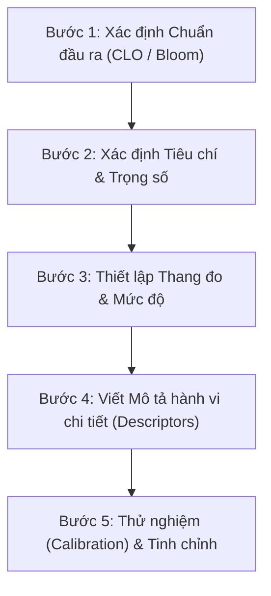

# HƯỚNG DẪN XÂY DỰNG VÀ HOÀN THIỆN BỘ RUBRIC ĐÁNH GIÁ
*(Áp dụng theo từng Môn học hoặc từng Câu hỏi / Bài tập cụ thể)*

---

## I. Phân biệt phạm vi áp dụng

### 1. Rubric theo Môn học (Analytic Rubric - Dạng phân tích)
* **Mục tiêu:** Đánh giá bài tập lớn, đồ án, tiểu luận, thuyết trình, bài kiểm tra tổng hợp hoặc năng lực thực hành xuyên suốt học phần.
* **Đặc điểm:** Các tiêu chí mang tính năng lực tổng quát (ví dụ: tư duy logic, cấu trúc nội dung, phương pháp nghiên cứu, kỹ năng trình bày, chuẩn trích dẫn).

### 2. Rubric theo Từng câu cụ thể (Task/Item-Specific Rubric - Dạng đặc thù)
* **Mục tiêu:** Áp dụng cho từng câu hỏi tự luận, bài tập tình huống, code/lập trình, bài toán định lượng.
* **Đặc điểm:** Bám sát đáp án mẫu, chia nhỏ điểm theo các bước tư duy, luận điểm hoặc kết quả cụ thể mà người học bắt buộc phải đạt.

---

## II. Quy trình 5 bước xây dựng và hoàn thiện Rubric

### Bước 1: Xác định Chuẩn đầu ra & Mục tiêu đánh giá
* Căn cứ vào Chuẩn đầu ra học phần (CLO/PLO) hoặc yêu cầu của đề bài.
* Xác định rõ: Học viên cần **thể hiện kiến thức gì** (Biết/Hiểu) và **làm được kỹ năng gì** (Vận dụng/Phân tích/Sáng tạo - theo thang đo Bloom).

### Bước 2: Xác định các Tiêu chí đánh giá (Criteria) và Trọng số (Weight)
* Chọn từ **3 đến 5 tiêu chí then chốt**, tránh làm loãng bởi các tiêu chí phụ không đáng kể.
* Mỗi tiêu chí phải độc lập, phân định rõ ràng, không trùng lặp ý nghĩa.
* Gán trọng số / thang điểm cụ thể cho từng tiêu chí tùy theo mức độ quan trọng (tổng = 100% hoặc thang điểm 10).

### Bước 3: Thiết lập các Mức độ thành thạo (Performance Levels)
* Thường chia thành **4 – 5 mức độ** (tránh dùng số mức chẵn quá ít vì dễ gây phân vân ở mức giữa):
  * **Xuất sắc (8.5 – 10.0):** Vượt kỳ vọng, lập luận sắc bén, chính xác tuyệt đối.
  * **Khá / Đạt (7.0 – 8.4):** Đạt đầy đủ yêu cầu chính, có thể có lỗi nhỏ không ảnh hưởng bản chất.
  * **Trung bình (5.0 – 6.9):** Đạt mức tối thiểu, còn thiếu sót hoặc sai lệch một phần.
  * **Chưa đạt / Yếu (0 – 4.9):** Thiếu luận điểm chính, sai kiến thức cơ bản hoặc lạc đề.

### Bước 4: Viết Mô tả hành vi chi tiết (Performance Descriptors)
* **Nguyên tắc cốt lõi:** Mô tả bằng **hành vi quan sát được** và **số lượng/chất lượng cụ thể**, tránh dùng các từ cảm tính như *"làm bài tốt"*, *"trình bày ổn"*.
  * *Ví dụ kém:* "Nội dung khá đầy đủ."
  * *Ví dụ chuẩn:* "Nêu được ít nhất 3 trong 4 nguyên nhân chính; phân tích được mối liên hệ giữa các biến số với dẫn chứng minh họa thực tế."

### Bước 5: Thử nghiệm (Calibration) và Chuẩn hóa
* **Chấm thử mẫu (Blind pilot):** Áp dụng rubric để 2 giáo viên cùng chấm độc lập 5–10 bài/câu trả lời ngẫu nhiên.
* **Đối chiếu độ lệch:** Nếu có sự chênh lệch lớn giữa các người chấm, rà soát lại mô tả hành vi xem có chỗ nào diễn giải mơ hồ.
* **Tinh chỉnh:** Bổ sung các trường hợp biên (edge cases), các lỗi học sinh thường mắc phải vào phần mô tả.

---

## III. Mẫu khung Rubric trực quan

### 1. Mẫu Rubric theo Môn học (Đồ án / Tiểu luận / Thuyết trình)

| Tiêu chí (Trọng số) | Xuất sắc (8.5 - 10) | Khá / Đạt (7.0 - 8.4) | Trung bình (5.0 - 6.9) | Chưa đạt (< 5.0) |
| :--- | :--- | :--- | :--- | :--- |
| **Nội dung & Lập luận** *(40%)* | Trả lời đầy đủ, phân tích sâu sắc, có dẫn chứng xác thực và giải pháp sáng tạo. | Đầy đủ nội dung chính, có phân tích nhưng chưa đào sâu các tình huống phụ. | Thiếu 1-2 ý quan trọng, lập luận còn mang tính liệt kê, thiếu chiều sâu. | Sai kiến thức cốt lõi hoặc lạc đề, không có dẫn chứng. |
| **Phương pháp & Dữ liệu** *(30%)* | Áp dụng đúng công cụ/mô hình, phân tích số liệu chính xác 100%. | Áp dụng đúng phương pháp, có 1-2 sai số nhỏ không ảnh hưởng kết luận. | Chọn phương pháp chưa tối ưu hoặc xử lý dữ liệu còn thiếu sót. | Áp dụng sai phương pháp, số liệu bịa đặt hoặc thiếu căn cứ. |
| **Hình thức & Trình bày** *(20%)* | Bố cục chuẩn mực, văn phong học thuật, trích dẫn chuẩn xác (APA/IEEE). | Đúng quy chuẩn, có vài lỗi chính tả/định dạng nhỏ. | Lỗi chính tả, căn lề nhiều; trích dẫn nguồn thiếu nhất quán. | Trình bày cẩu thả, không tuân thủ quy định văn bản. |
| **Phản biện / Vấn đáp** *(10%)* | Trả lời gãy gọn, tự tin, làm rõ mọi câu hỏi của hội đồng. | Trả lời được hầu hết câu hỏi, còn ngập ngừng ở câu nâng cao. | Chỉ trả lời được các câu cơ bản, cần nhiều gợi ý. | Không trả lời được câu hỏi chuyên môn. |

---

### 2. Mẫu Rubric theo Câu hỏi tự luận cụ thể (Thang 2.0 điểm)

> **Ví dụ câu hỏi:** *"Phân tích nguyên nhân và đề xuất giải pháp giảm thiểu ô nhiễm không khí tại đô thị."*

| Thành phần câu hỏi | Mức đạt điểm tối đa (Full marks) | Mức đạt một phần (Partial marks) | Không đạt (No mark) |
| :--- | :--- | :--- | :--- |
| **1. Nêu và phân tích nguyên nhân** *(1.0 điểm)* | **1.0 đ:** Nêu đủ cả 2 nhóm nguyên nhân (tự nhiên & nhân tạo: giao thông, xây dựng, công nghiệp) kèm số liệu/ví dụ thực tế. | **0.5 đ:** Chỉ nêu được nguyên nhân nhân tạo hoặc liệt kê không có phân tích/dẫn chứng minh họa. | **0 đ:** Không nêu được nguyên nhân đúng hoặc trả lời lạc đề. |
| **2. Đề xuất giải pháp khả thi** *(0.75 điểm)* | **0.75 đ:** Đưa ra tối thiểu 3 giải pháp phân theo cấp độ (chính sách vĩ mô, hạ tầng kỹ thuật, hành vi cá nhân) có tính khả thi cao. | **0.25 - 0.5 đ:** Đưa ra 1-2 giải pháp chung chung (vd: "trồng cây", "tuyên truyền"), thiếu tính đột phá hoặc không gắn với nguyên nhân. | **0 đ:** Giải pháp viển vông, không thực tế hoặc bỏ trống phần này. |
| **3. Cấu trúc logic & Tính liên kết** *(0.25 điểm)* | **0.25 đ:** Trình bày có mở đầu - phân tích - kết luận; liên kết mạch lạc giữa nguyên nhân và giải pháp. | **0 đ:** Viết rời rạc, gạch đầu dòng ngắt quãng, không có mạch kết nối lập luận. | **0 đ:** Viết lộn xộn, sai ngữ pháp nghiêm trọng. |

---

## IV. Kinh nghiệm thực tế để Rubric đạt độ tin cậy cao

1. **Minh bạch hóa với người học:** Công bố rubric ngay thời điểm giao đề bài để học sinh chủ động định hướng chất lượng bài làm.
2. **Xử lý các lỗi ngoại lệ (Penalties):** Quy định rõ trừ điểm cho các lỗi như: nộp muộn, đạo văn (Plagiarism), thiếu trích dẫn nguồn, vượt/thiếu số từ quy định.
3. **Tối ưu cho việc chấm tự động bằng AI / RAG:**
   * Mỗi tiêu chí cần có các **từ khóa (keywords)** và **các chốt kiểm tra logic (decision checkpoints)** rõ ràng.
   * Cung cấp các cặp ví dụ câu trả lời mẫu cho từng mức điểm (Few-shot prompting) để mô hình AI chấm điểm chuẩn xác, giảm thiểu ảo giác.
