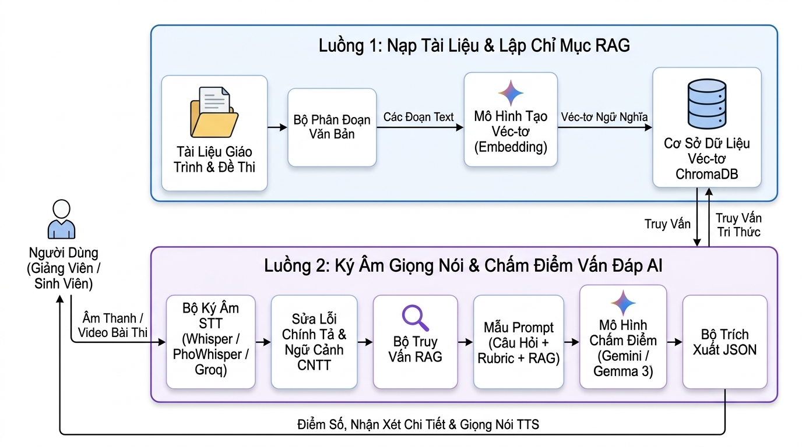
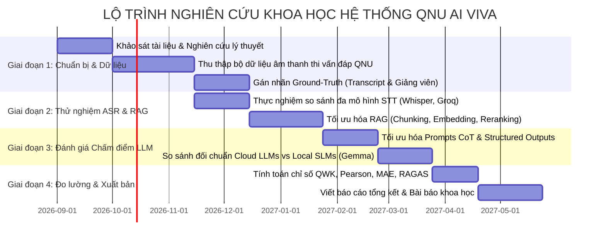

# 📑 ĐỀ CƯƠNG VÀ ĐỊNH HƯỚNG NGHIÊN CỨU KHOA HỌC
## HỆ THỐNG TRỢ LÝ KÝ ÂM GIỌNG NÓI & CHẤM ĐIỂM THI VẤN ĐÁP TỰ ĐỘNG BẰNG AI (QNU AI VIVA)

---

## 📌 PHẦN 1: TỔNG QUAN ĐỀ TÀI & TÍNH CẤP THIẾT HỌC THUẬT

### 1.1. Tên đề tài khoa học đề xuất
* **Tên tiếng Việt:** *"Nghiên cứu, phát triển hệ thống trợ lý ký âm giọng nói tiếng Việt và tự động đánh giá thi vấn đáp chuyên ngành Công nghệ thông tin ứng dụng mô hình ngôn ngữ lớn và kỹ thuật truy xuất tri thức tăng cường (RAG)"*
* **Tên tiếng Anh:** *"An End-to-End AI-Assisted System for Vietnamese Oral Exam Transcription and Automated Viva Voce Grading Using Retrieval-Augmented Generation and Large Language Models"*
* **Lĩnh vực nghiên cứu:** Xử lý ngôn ngữ tự nhiên (NLP), Nhận dạng giọng nói (ASR), Ứng dụng AI trong giáo dục (AI in Education - AIED), Đánh giá tự động (Automated Scoring).

### 1.2. Tính cấp thiết & Bài toán thực tiễn
* **Thực trạng thi vấn đáp (Viva Voce):** Thi vấn đáp là hình thức đánh giá sâu sắc năng lực tư duy phản biện, khả năng phản xạ và độ hiểu bản chất của sinh viên. Tuy nhiên, phương pháp này gặp các rào cản lớn:
  1. *Tốn kém thời gian & nguồn lực giảng viên:* Mỗi ca thi vấn đáp kéo dài 10–20 phút/sinh viên, tạo áp lực lớn cho hội đồng chấm thi.
  2. *Tính chủ quan và thiếu nhất quán (Inter-rater Variability):* Cùng một câu trả lời nhưng điểm số có thể dao động tùy thuộc vào tâm lý, sự mệt mỏi hoặc định kiến cá nhân của giám khảo.
  3. *Thiếu phản hồi chi tiết tức thì (Formative Feedback):* Giảng viên thường chỉ cho điểm số tổng quát mà không đủ thời gian giải thích chi tiết điểm mạnh, điểm yếu và lộ trình cải thiện cho sinh viên.
  4. *Khó khăn trong việc lưu trữ bằng chứng kiểm định chất lượng:* Việc ghi âm/ghi hình bài thi vấn đáp ít khi được chuyển thành văn bản để tra cứu hoặc phúc khảo do chi phí ký âm thủ công quá cao.
* **Mục tiêu nghiên cứu:** Xây dựng một luồng pipeline hoàn chỉnh:
  $$\text{Audio Input} \xrightarrow{\text{ASR}} \text{Raw Transcript} \xrightarrow{\text{Post-Processing}} \text{Clean Transcript} \xrightarrow{\text{RAG Context}} \text{LLM/SLM Grading} \xrightarrow{\text{Structured Output}} \text{Rubric Scores + Multi-modal Feedback}$$

### 1.3. Sơ đồ kiến trúc luồng chi tiết của hệ thống thử nghiệm hiện tại
Hệ thống thử nghiệm được thiết kế theo kiến trúc 2 tầng độc lập và tích hợp chặt chẽ (Pipeline 1: Nạp tri thức giáo trình & Lập chỉ mục RAG; Pipeline 2: Ký âm giọng nói, Truy xuất & Đánh giá thi vấn đáp):



### 1.4. Đóng góp khoa học và tính mới (Novelty & Contributions)
1. **Xử lý hiện tượng trộn ngữ (Code-Switching) chuyên ngành CNTT:** Giải quyết bài toán nhận dạng giọng nói tiếng Việt kết hợp dày đặc thuật ngữ tiếng Anh (ví dụ: *OOP, Interface, Scrum Master, Polymorphism, Backlog*) trong môi trường thi học thuật.
2. **Cơ chế RAG chống ảo giác trong chấm điểm tự động (Faithful Grading):** Thay vì để LLM tự do suy diễn điểm số, hệ thống buộc LLM phải neo (grounding) vào tài liệu chuẩn mực (giáo trình, slide bài giảng, chuẩn đầu ra môn học) đã được index vào Vector Database.
3. **So sánh toàn diện giữa Cloud LLMs và Local SLMs (On-Premise):** Đánh giá hiệu năng và độ chính xác giữa các mô hình đám mây thương mại (Google Gemini Flash/Pro) và các mô hình nguồn mở chạy cục bộ (Gemma 3, Qwen 2.5 qua Ollama), phục vụ bài toán bảo mật dữ liệu thi cử và triển khai tại các trường đại học không có kết nối Internet liên tục.
4. **Định dạng cấu trúc hóa chặt chẽ kết hợp giọng nói phản hồi (Explainable & Auditory Feedback):** Đảm bảo phản hồi có tính giải thích cao (XAI) theo chuẩn JSON Schema và chuyển hóa thành giọng nói sư phạm (TTS).

---

## 🔬 PHẦN 2: CÁC NỘI DUNG NGHIÊN CỨU KHOA HỌC TRỌNG TÂM

```
┌───────────────────────────────────────────────────────────────────────────────────┐
│                      6 HƯỚNG NGHIÊN CỨU KHOA HỌC CỐT LÕI                           │
├───────────────────┬───────────────────┬───────────────────┬───────────────────────┤
│  1. Nhận dạng     │  2. Hiệu đính     │  3. RAG Giáo trình│  4. Đánh giá tự động  │
│  giọng nói &      │  ngữ cảnh &       │  & Truy xuất      │  bằng LLM/SLM         │
│  Code-Switching   │  Error Mitigation │  ngữ nghĩa        │  theo Rubric          │
├───────────────────┴───────────────────┴───────────────────┴───────────────────────┤
│  5. Đo lường tương quan học thuật & Benchmark (WER, QWK, Pearson, RAGAS)          │
├───────────────────────────────────────────────────────────────────────────────────┤
│  6. Đạo đức AI, Công bằng theo giọng vùng miền & Bảo mật triển khai Offline       │
└───────────────────────────────────────────────────────────────────────────────────┘
```

---

### HƯỚNG 1: Nhận dạng giọng nói (ASR) tiếng Việt pha trộn thuật ngữ chuyên ngành CNTT

#### 1.1. Vấn đề khoa học
* Mô hình ASR tiếng Việt thông thường được huấn luyện trên tin tức hoặc giao tiếp thường ngày, do đó khi sinh viên phát âm các từ chuyên ngành mượn từ tiếng Anh (ví dụ: *"lớp trừu tượng"*, *"polymorphism"*, *"agile"*, *"sprint"*, *"scrum"*), các mô hình thường phiên âm sai thành các từ đồng âm tiếng Việt kỳ lạ (*"lắp"*, *"úp"*, *"ô ô bê"*).
* Ảnh hưởng của ngữ điệu vùng miền (giọng miền Trung, miền Nam, miền Bắc) và tạp âm môi trường phòng thi (tiếng vang, tiếng gõ bàn phím, tiếng ồn xung quanh).

#### 1.2. Nhiệm vụ nghiên cứu cụ thể
1. **Tiền xử lý tín hiệu âm thanh (Audio Pre-processing):**
   * Nghiên cứu thuật toán tách luồng âm thanh tự động từ video (FFmpeg) với tốc độ lấy mẫu chuẩn hóa (16kHz mono).
   * Ứng dụng thuật toán phát hiện hoạt động giọng nói (**Voice Activity Detection - VAD**) như Silero VAD hoặc WebRTC VAD để loại bỏ các khoảng lặng kéo dài (silence/pauses), ngập ngừng (*"à"*, *"ừm"*), giúp giảm tài nguyên tính toán cho ASR.
   * Kỹ thuật lọc nhiễu âm thanh phòng thi (Spectral Gating / Noise Reduction).
2. **Nghiên cứu thực nghiệm so sánh đa kiến trúc ASR:**
   * **Nhóm mô hình chạy cục bộ (Offline Local Edge):**
     * OpenAI Whisper (`tiny`, `base`, `small`, `medium`) - Phân tích sự đánh đổi giữa kích thước mô hình (Parameters/VRAM) và chất lượng phiên âm tiếng Việt.
     * VinAI PhoWhisper (`PhoWhisper-small`, `PhoWhisper-base`) - Đánh giá ưu thế của mô hình pre-trained chuyên biệt cho tiếng Việt.
   * **Nhóm mô hình đám mây siêu tốc (Cloud API):**
     * Groq Cloud (`whisper-large-v3` chạy trên chip LPU - Language Processing Unit).
     * Google Gemini Multimodal Audio (xử lý trực tiếp file âm thanh không qua bước ASR trung gian).
3. **Thước đo đánh giá khoa học (ASR Metrics):**
   * **WER (Word Error Rate):** Tỷ lệ lỗi cấp độ từ khóa chuyên ngành so với từ ngữ thông thường.
   * **CER (Character Error Rate):** Tỷ lệ lỗi cấp ký tự (đặc biệt quan trọng đối với tiếng Việt có dấu thanh).
   * **RTF (Real-Time Factor):** Thời gian xử lý / Độ dài file âm thanh thực tế.
   * **Latency (ms) & Mức tiêu thụ tài nguyên (VRAM/RAM Peak).**

---

### HƯỚNG 2: Hiệu đính ngữ nghĩa theo ngữ cảnh & Giảm thiểu lan truyền lỗi (Error Propagation)

#### 2.1. Vấn đề khoa học
* Nếu bước ASR tạo ra bản ký âm có lỗi, liệu lỗi này có làm sai lệch kết quả chấm điểm của mô hình ngôn ngữ lớn ở bước sau hay không? Hiện tượng này trong học thuật gọi là **Error Propagation (Lan truyền lỗi từ ASR sang NLP Downstream Task)**.

#### 2.2. Nhiệm vụ nghiên cứu cụ thể
1. **Cơ chế Prompt-Guided Post-Correction:**
   * Nghiên cứu thiết kế prompt thông minh đưa **Đề bài thi** và **Từ khóa Rubric** làm bối cảnh (context) cho LLM để suy đoán và tự động phục hồi các từ bị ASR nghe nhầm.
   * Xây dựng từ điển ngữ âm chuyên ngành (Phonetic Dictionary / Domain Vocabulary Mapping) kết hợp thuật toán so khớp chuỗi mờ (Fuzzy Matching / Levenshtein Distance) với các thuật ngữ CNTT.
2. **Nghiên cứu tác động của mức độ lỗi ASR đến độ lệch điểm số (Sensitivity Analysis):**
   * Tiến hành thực nghiệm nhiễu nhân tạo (Perturbation Testing): Cố tình tạo ra các bản ký âm có WER từ $5\% \rightarrow 30\%$ và kiểm tra xem điểm số LLM chấm có bị giảm tuyến tính hay phi tuyến tính.
   * Xác định "ngưỡng dung sai WER" (WER Tolerance Threshold) mà tại đó LLM vẫn cho ra kết quả chấm chính xác tương đương giám khảo con người.
3. **Cơ chế tương tác Human-in-the-loop (HITL):**
   * Đánh giá hiệu quả công việc của giảng viên khi có giao diện cho phép xem trước và hiệu đính nhanh bản ký âm trước khi kích hoạt module chấm điểm.

---

### HƯỚNG 3: Kiến trúc RAG (Retrieval-Augmented Generation) chuyên biệt cho dữ liệu giáo trình học thuật

#### 3.1. Vấn đề khoa học
* Đề thi vấn đáp và câu trả lời của sinh viên đòi hỏi tính chính xác học thuật tuyệt đối theo đúng giáo trình môn học của nhà trường (ví dụ: *Bộ câu hỏi ôn tập CNPM, Đề cương chi tiết học phần Nhập môn CNPM*).
* Các mô hình LLM tổng quát thường đưa ra câu trả lời chung chung trên Internet hoặc bị "ảo giác" (hallucination), không bám sát định nghĩa trong giáo trình của giảng viên.

#### 3.2. Nhiệm vụ nghiên cứu cụ thể
1. **Chiến lược phân đoạn văn bản thông minh (Academic Chunking Strategy):**
   * So sánh phương pháp chia đoạn theo ký tự cố định (Fixed-size Chunking) với phương pháp phân đoạn theo ngữ nghĩa (Semantic Chunking) và phân đoạn dựa trên ranh giới văn bản tự nhiên (Boundary-Preserved Chunking).
   * Kỹ thuật trích xuất bảng biểu, danh sách có thứ tự từ tệp `.docx`, `.pdf`, loại bỏ metadata rác của trình soạn thảo.
   * Thuật toán Overlap sạch: Giữ trọn vẹn từ ngữ (clean word boundaries) ở đầu và cuối mỗi đoạn trích, không để đứt gãy khái niệm kỹ thuật.
2. **Đánh giá mô hình biểu diễn véc-tơ (Text Embedding Benchmark):**
   * Thực nghiệm so sánh các mô hình Embedding đa ngữ và tiếng Việt:
     * `paraphrase-multilingual-MiniLM-L12-v2` (nhẹ, tối ưu CPU).
     * `BAAI/bge-m3` (đa ngữ hiện đại, hỗ trợ ngữ cảnh dài).
     * `bkai-foundation-models/vietnamese-bi-encoder` (chuyên biệt cho tiếng Việt).
     * `text-embedding-004` (Google Cloud).
   * Đánh giá độ chính xác không gian véc-tơ (Cosine Similarity vs L2 Distance) trên tập câu hỏi - đáp CNTT.
3. **Tối ưu hóa chiến lược truy xuất (Advanced Retrieval):**
   * **Query Reformulation:** Nghiên cứu kỹ thuật kết hợp giữa *Nội dung câu hỏi đề bài* và *Ý trả lời của sinh viên* để tạo ra véc-tơ truy vấn tối ưu nhất.
   * **Hybrid Search:** Kết hợp tìm kiếm từ khóa thưa (Sparse Retrieval - BM25) cho các mã lệnh, tên viết tắt và tìm kiếm véc-tơ dày (Dense Retrieval - HNSW ChromaDB) cho ngữ nghĩa tổng quát.
   * **Reranking:** Ứng dụng mô hình Cross-Encoder để chấm lại điểm phù hợp cho Top-$K$ tài liệu trước khi nạp vào LLM Context.
4. **Thước đo đánh giá hiệu năng RAG (RAG Evaluation Framework):**
   * Sử dụng khung đo lường học thuật **RAGAS** hoặc **TruLens**:
     * **Context Precision:** Đo lường tỷ lệ các đoạn trích xuất thực sự chứa câu trả lời đúng.
     * **Context Recall:** Khả năng truy xuất đầy đủ toàn bộ kiến thức cần thiết trong giáo trình.
     * **Faithfulness (Độ trung thực):** Tỷ lệ các luận điểm trong nhận xét của AI được suy diễn trực tiếp từ đoạn trích RAG (chứng minh không ảo giác).
     * **Answer Relevance:** Mức độ liên quan của phản hồi đối với đề bài.

---

### HƯỚNG 4: Đánh giá & Chấm điểm tự động bằng LLMs/SLMs theo chuẩn Rubric

#### 4.1. Vấn đề khoa học
* Làm thế nào để mô hình AI chấm điểm nhất quán, công bằng, tuân thủ đúng thang điểm chi tiết (Rubric) của giảng viên và đưa ra nhận xét có giá trị sư phạm?
* Khả năng thay thế các mô hình Cloud đắt đỏ bằng các mô hình SLM nguồn mở chạy cục bộ (Edge AI) trong việc chấm bài thi nói.

#### 4.2. Nhiệm vụ nghiên cứu cụ thể
1. **Kỹ thuật thiết kế Prompt & Chuỗi suy luận (Chain-of-Thought - CoT):**
   * Áp dụng nguyên lý CoT: Bắt buộc mô hình thực hiện suy luận từng tiêu chí trong Rubric (định nghĩa $\rightarrow$ ví dụ $\rightarrow$ kỹ năng diễn đạt) trước khi tổng hợp điểm cuối cùng.
   * Ép buộc định dạng phản hồi bằng **JSON Schema (Structured Outputs)**: Đảm bảo dữ liệu đầu ra luôn có cấu trúc lập trình ổn định (`score`, `summary`, `strengths`, `weaknesses`, `improvement`), triệt tiêu hiện tượng sinh text tự do.
2. **Nghiên cứu đối sánh mô hình Cloud LLMs vs On-Premise SLMs:**
   * **Cloud LLMs:** Google Gemini 2.5 Flash, Gemini 2.5 Pro, Gemini 2.0 Flash.
   * **Local Small Language Models (SLMs qua Ollama):**
     * `gemma3:4b`, `gemma3:12b` (Google).
     * `qwen2.5:7b` (Alibaba - cực mạnh về tiếng Việt và reasoning).
     * `llama3.2:3b`, `llama3.1:8b` (Meta).
   * Phân tích tương quan điểm số giữa Local SLM và Cloud LLM: Xác định xem mô hình 4B/7B chạy trên máy tính cá nhân/máy chủ khoa có đạt được độ chính xác tương đương mô hình đám mây hay không.
3. **Độ tin cậy và tính ổn định (Reliability & Variance Analysis):**
   * Đánh giá tham số Temperature ($T = 0.0$ so với $T = 0.2, 0.7$): Đo lường phương sai điểm số khi cho cùng một bài làm chạy lặp lại 10 lần.
   * Phân tích độ lệch chuẩn (Standard Deviation) của điểm số AI.

---

### HƯỚNG 5: Phương pháp luận thực nghiệm, Bộ dữ liệu chuẩn & Đo lường học thuật

#### 5.1. Xây dựng Bộ dữ liệu đối sánh chuẩn (Benchmark Dataset - QNU-Viva-IT)
* Thu thập mẫu thử nghiệm thực tế:
  * Số lượng mẫu: Tối thiểu 50 – 100 bài thi vấn đáp thực tế hoặc đóng vai (Role-playing) của sinh viên ngành CNTT.
  * Phân bố sinh viên: Đa dạng giọng đọc (Bắc, Trung, Nam; đặc biệt phát âm vùng Duyên hải Nam Trung Bộ - Bình Định).
  * Đa dạng mức độ làm bài: Giỏi (8–10 điểm), Khá (6.5–7.9), Trung bình (5.0–6.4), Yếu/kém (<5.0, trả lời lạc đề hoặc ấp úng).
* Thiết lập Ground-Truth (Chân thực chuẩn):
  * **Transcript Ground-Truth:** Văn bản được gõ lại thủ công chính xác 100% từ băng ghi âm.
  * **Score Ground-Truth:** Điểm số và nhận xét do Hội đồng gồm **02 – 03 Giảng viên đại học** chấm độc lập, sau đó lấy điểm trung bình hoặc giải quyết bất đồng theo phương pháp Delphi.

#### 5.2. Các chỉ số đo lường khoa học (Evaluation Metrics)
1. **Độ tương quan giữa AI và Giảng viên (Human-AI Agreement):**
   * **Quadratic Weighted Kappa (QWK):** Thước đo chuẩn mực quốc tế trong các bài toán chấm điểm tự động (Automated Essay/Speech Scoring - AES/ASG). Giá trị QWK $> 0.75$ thể hiện độ đồng thuận cao giữa AI và con người.
   * **Hệ số tương quan Pearson ($r$):** Đo lường mức độ tương quan tuyến tính giữa điểm AI và điểm trung bình của giảng viên.
   * **Hệ số tương quan thứ bậc Spearman ($\rho$):** Đo lường khả năng xếp hạng đúng thứ tự học lực sinh viên của AI.
   * **MAE (Mean Absolute Error) & RMSE (Root Mean Squared Error):** Độ lệch điểm tuyệt đối trung bình giữa AI và con người (mục tiêu: $\text{MAE} \le 0.5$ điểm trên thang 10).
2. **Chỉ số đánh giá độ tin cậy giữa các giám khảo (Inter-Rater Reliability - IRR):**
   * So sánh hệ số tương quan giữa [Giảng viên A vs Giảng viên B] với hệ số tương quan giữa [Giảng viên vs AI]. Nếu tương quan giữa AI và Giảng viên tương đương hoặc vượt trội so với giữa hai giảng viên với nhau, hệ thống đạt độ tin cậy khoa học tương đương con người.

---

### HƯỚNG 6: Đạo đức AI, Tính công bằng (Fairness) & An toàn dữ liệu trong giáo dục

#### 6.1. Vấn đề khoa học
* Khi áp dụng AI vào thi cử chính thức, tính công bằng (Fairness) và tính giải thích được (Explainability) là yêu cầu tiên quyết để tránh khiếu nại của người học.

#### 6.2. Nhiệm vụ nghiên cứu cụ thể
1. **Phân tích thiên lệch theo giọng điệu vùng miền (Accent/Dialect Bias):**
   * Kiểm định giả thuyết: Liệu sinh viên nói giọng địa phương (đặc thù ngữ âm miền Trung, dấu hỏi/ngã, nguyên âm ngắn) có bị hệ thống chấm điểm thấp hơn sinh viên nói giọng chuẩn Hà Nội/Sài Gòn hay không?
   * Đề xuất phương pháp cân bằng ngữ âm và chuẩn hóa văn bản trước khi đưa vào chấm điểm.
2. **Tính giải thích được của quyết định chấm điểm (Explainable AI - XAI):**
   * Đánh giá chất lượng của 3 trường dữ liệu: `strengths` (Điểm mạnh), `weaknesses` (Điểm yếu), `improvement` (Gợi ý cải thiện).
   * Khảo sát người học theo mô hình chấp nhận công nghệ (TAM - Technology Acceptance Model hoặc UTAUT): Đo lường mức độ hài lòng, sự tin tưởng và động lực học tập của sinh viên khi nhận phản hồi chi tiết từ AI.
3. **Bảo mật dữ liệu thi cử & Quyền riêng tư (Privacy & On-Premise Deployment):**
   * Nghiên cứu giải pháp bảo vệ dữ liệu giọng nói sinh viên (không gửi âm thanh bài thi của sinh viên lên máy chủ bên thứ ba nếu vi phạm chính sách bảo mật của cơ sở đào tạo).
   * Xây dựng mô hình "Full-Offline Sandbox": Kết hợp Whisper Local + ChromaDB Local + Gemma 3 Local, vận hành trọn vẹn trong mạng LAN nội bộ của trường đại học.

---

## 📅 PHẦN 3: LỘ TRÌNH THỰC HIỆN ĐỀ TÀI (ROADMAP)



| Giai đoạn | Thời gian | Nhiệm vụ chính | Sản phẩm đầu ra (Deliverables) |
| :--- | :---: | :--- | :--- |
| **Giai đoạn 1** | Tháng 1 - 2 | Thu thập mẫu âm thanh vấn đáp, chuẩn bị tài liệu giáo trình và rubric; tổ chức hội đồng giảng viên chấm điểm độc lập. | Bộ Dataset `QNU-Viva-IT` gồm 50–100 mẫu âm thanh có đầy đủ văn bản và điểm số chuẩn. |
| **Giai đoạn 2** | Tháng 3 - 4 | Thử nghiệm các mô hình ASR (Whisper, PhoWhisper, Groq); tối ưu thuật toán phân đoạn và nhúng véc-tơ cho tài liệu giáo trình. | Báo cáo phân tích WER/CER của các mô hình STT; module RAG tối ưu đạt chỉ số RAGAS cao. |
| **Giai đoạn 3** | Tháng 5 - 6 | Thử nghiệm đối sánh các mô hình LLM/SLM (Gemini vs Gemma/Qwen); tối ưu hóa Prompt CoT và bộ sửa lỗi ngữ cảnh. | Bảng kết quả đối sánh đa mô hình; pipeline chấm điểm tự động hoàn thiện. |
| **Giai đoạn 4** | Tháng 7 - 8 | Tính toán các chỉ số thống kê học thuật (QWK, Pearson, Spearman, MAE); khảo sát người dùng (UTAUT). | Bài báo khoa học hoàn chỉnh; Báo cáo tổng kết đề tài; Mã nguồn đã benchmark. |

---

## 📄 PHẦN 4: ĐỀ XUẤT CẤU TRÚC BÀI BÁO KHOA HỌC (PAPER STRUCTURE)

Dự kiến công bố tại các hội thảo khoa học chuyên ngành (ví dụ: FAIR, KSE, RIVF, NICS) hoặc các tạp chí khoa học uy tín (Tạp chí Khoa học ĐH Quy Nhơn, Tạp chí KH&CN Việt Nam, IEEE Access, Springer Education and Information Technologies):

* **Title:** *Enhancing Automated Viva Voce Grading for Vietnamese Computing Students through Domain-Specific ASR, RAG, and Large Language Models*
* **Abstract:** Tóm tắt bối cảnh, khoảng trống nghiên cứu, phương pháp đề xuất (Pipeline kết hợp STT + RAG + LLM), kết quả định lượng chính (WER, QWK, thời gian xử lý) và kết luận sư phạm.
* **1. Introduction:** Tính cấp thiết của thi vấn đáp, hạn chế của chấm điểm thủ công, đóng góp chính của bài báo.
* **2. Related Work:**
  * *Automated Speech Recognition for Vietnamese and Code-Switching.*
  * *Retrieval-Augmented Generation in Education.*
  * *Automated Essay/Oral Scoring (AES/AOS) with Large Language Models.*
* **3. Proposed System Architecture:**
  * Sơ đồ khối pipeline tổng thể.
  * *Stage 1:* Audio Acquisition, VAD & Multi-model STT.
  * *Stage 2:* Context-aware Text Normalization & Spell Checking.
  * *Stage 3:* Curriculum-grounded RAG Module (Chunking, Embedding & ChromaDB).
  * *Stage 4:* Rubric-based LLM/SLM Grading with Structured JSON Output.
* **4. Experimental Setup:**
  * Mô tả bộ ngữ liệu thử nghiệm `QNU-Viva-IT`.
  * Các kịch bản thử nghiệm (Có RAG vs Không RAG; Cloud LLM vs Local SLM; Local Whisper vs Cloud ASR).
  * Thước đo đánh giá: WER, CER, QWK, Pearson $r$, MAE, Latency, RAGAS.
* **5. Results & Discussion:**
  * *RQ1:* Hiệu năng nhận dạng của các mô hình STT trên giọng nói chuyên ngành CNTT tiếng Việt?
  * *RQ2:* Module RAG cải thiện độ chính xác và giảm thiểu ảo giác trong chấm điểm như thế nào?
  * *RQ3:* Mức độ đồng thuận (Agreement) giữa mô hình AI và Hội đồng giảng viên con người (QWK)?
  * *RQ4:* So sánh hiệu năng - chi phí - bảo mật giữa Cloud LLMs (Gemini) và On-Premise SLMs (Gemma 3 qua Ollama)?
* **6. Ethical Considerations & Limitations:** Thảo luận về thiên lệch giọng vùng miền, tính minh bạch và các trường hợp ngoại lệ.
* **7. Conclusion & Future Work:** Kết luận và định hướng phát triển mô hình chấm điểm đa phương thức kết hợp thị giác máy tính (phân tích cử chỉ, nét mặt sinh viên).

---

## 📚 PHẦN 5: TÀI LIỆU THAM KHẢO HỌC THUẬT QUAN TRỌNG

1. **Radford, A., et al.** (2023). *Robust Speech Recognition via Large-Scale Weak Supervision*. International Conference on Machine Learning (ICML) - [OpenAI Whisper].
2. **Lewis, P., et al.** (2020). *Retrieval-Augmented Generation for Knowledge-Intensive NLP Tasks*. Advances in Neural Information Processing Systems (NeurIPS).
3. **Es, S., et al.** (2023). *RAGAS: Automated Evaluation of Retrieval Augmented Generation*. arXiv preprint arXiv:2309.15217.
4. **Al-Hoorie, A. H., & Vitta, J. P.** (2019). *The Quadratic Weighted Kappa in Automated Scoring: A Critical Review*. Language Assessment Quarterly.
5. **Team Gemma, Google** (2025). *Gemma 3: Open Models for Multimodal and On-Device Artificial Intelligence*. Google DeepMind Technical Report.
6. **Nguyen, Q. T., et al.** (2023). *PhoWhisper: A Vietnamese Speech Recognition Model based on Whisper*. VinAI Research.
7. **Mizumoto, A., & Eguchi, M.** (2023). *Exploring the Potential of Large Language Models in Automated Essay Scoring*. Assessing Writing, 58, 100789.
