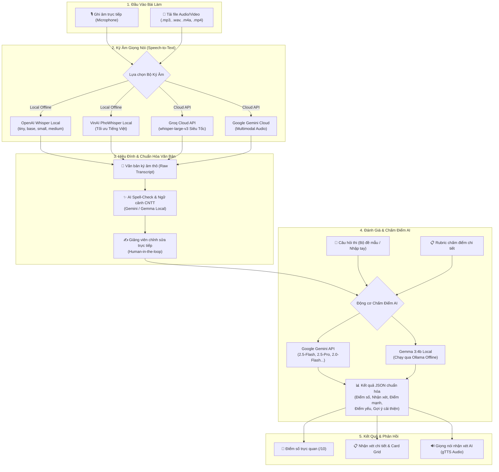

# 🎓 QNU AI VIVA - Hệ Thống Trợ Lý Ký Âm Giọng Nói & Chấm Điểm Thi Vấn Đáp AI

Hệ thống hỗ trợ giảng viên và sinh viên trong quy trình **chấm điểm và ôn luyện thi vấn đáp tự động** bằng công nghệ AI tiên tiến:
* **Speech-to-Text (STT):** Ký âm giọng nói linh hoạt với cả **Local Offline** (OpenAI Whisper, VinAI PhoWhisper) và **Cloud API** (Groq Whisper-large-v3, Google Gemini Cloud).
* **AI Post-Processing:** Tự động sửa lỗi chính tả, nhận diện thuật ngữ chuyên ngành CNTT theo ngữ cảnh câu hỏi và rubric.
* **AI Grading & Evaluation:** Chấm điểm và đưa ra nhận xét đa chiều theo tiêu chí Rubric chuẩn hóa bằng mô hình ngôn ngữ lớn (**Google Gemini** / **Local Gemma 3 qua Ollama**) với định dạng Structured Output (JSON Schema).
* **Text-to-Speech (TTS):** Tự động phát âm thanh nhận xét bằng giọng đọc tiếng Việt.

---

## 🔄 Sơ Đồ Quy Trình Pipeline Hệ Thống



---

## 📋 Chi Tiết Từng Giai Đoạn Trong Pipeline

### 1. Thu thập & Tiền xử lý âm thanh (Input Stage)
* Hệ thống tiếp nhận nguồn âm thanh từ ghi âm trực tiếp qua Microphone trên trình duyệt hoặc tải tệp lên.
* Hỗ trợ giải mã đa định dạng (`.mp3`, `.wav`, `.m4a`, `.aac`, `.flac`) và **tự động bóc tách luồng âm thanh từ video `.mp4`** nhờ công cụ FFmpeg.

### 2. Ký âm giọng nói thành văn bản (Speech-to-Text Stage)
Giảng viên có thể tùy biến linh hoạt phương thức chuyển đổi:
* **Whisper Local (OpenAI):** Chạy offline hoàn toàn trên CPU/GPU máy chủ, cơ chế quản lý VRAM/RAM thông minh tự động dọn dẹp bộ nhớ (Garbage Collection + CUDA empty cache).
* **PhoWhisper-small (VinAI):** Mô hình được tinh chỉnh đặc thù cho ngôn ngữ Tiếng Việt thông qua Hugging Face Transformers Pipeline.
* **Groq Cloud API:** Sử dụng mô hình `whisper-large-v3` trên nền tảng phần cứng LPU của Groq, cho tốc độ phiên âm chỉ từ 1-2 giây.
* **Gemini Cloud Multimodal:** Tải file âm thanh lên Gemini File API để phân tích và trích xuất nội dung bài nói.

### 3. Tự động sửa lỗi chính tả & Chuẩn hóa thuật ngữ (AI Post-Processing)
* Kết hợp nội dung câu hỏi đề thi và tiêu chí Rubric để AI suy đoán và sửa các lỗi nghe nhầm phát âm đặc trưng trong ngành CNTT (ví dụ: *'lắp'* -> *'lớp'*, *'úp / ô ô bê'* -> *'OOP'*, *'dưới liệu'* -> *'dữ liệu'*, *'chư tượng'* -> *'trừu tượng'*).
* Hỗ trợ cơ chế **Human-in-the-loop**: Giảng viên có thể xem trước và trực tiếp can thiệp, bổ sung, biên tập lại transcript trước khi chấm điểm.

### 4. Đánh giá & Chấm điểm tự động (AI Grading Stage)
* Đưa nội dung câu trả lời đã chuẩn hóa cùng Câu hỏi và Rubric vào mô hình LLM.
* Sử dụng **Structured Outputs (JSON Schema)** để đảm bảo cấu trúc phản hồi luôn tuân thủ nghiêm ngặt:
  - `score`: Điểm số trên thang 10.
  - `summary`: Nhận xét tổng quan của giảng viên AI.
  - `strengths`: Danh sách 3 điểm mạnh nổi bật.
  - `weaknesses`: Danh sách 3 điểm yếu / thiếu sót cần khắc phục.
  - `improvement`: Danh sách 2-3 gợi ý cải thiện điểm số.

### 5. Tổng hợp phản hồi & Giọng nói AI (TTS Output Stage)
* Trình bày kết quả trực quan trên giao diện Gradio với thẻ điểm gradient, phân loại màu sắc các thẻ đánh giá.
* Tích hợp công cụ **gTTS** tổng hợp nhận xét thành file âm thanh tiếng Việt để sinh viên có thể nghe nhận xét trực tiếp.

---

## 🛠️ Yêu cầu Hệ Thống & Cài Đặt

### 1. Cài đặt FFmpeg (Bắt buộc cho xử lý âm thanh/video)
Whisper và các thư viện âm thanh cần FFmpeg để giải mã định dạng file:

* **Cài đặt qua Windows Package Manager (Khuyên dùng):**
  ```powershell
  winget install Gyan.FFmpeg
  ```
  *(Khởi động lại Terminal/PowerShell sau khi cài đặt để cập nhật PATH)*

---

### 2. Cài đặt các thư viện Python

Cài đặt tất cả phụ thuộc từ [requirements.txt](file:///d:/speed-to-text-demo/requirements.txt):

```powershell
# Chạy với lệnh Python hệ thống
python -m pip install -r requirements.txt
```

Hoặc nếu bạn sử dụng đường dẫn Python cụ thể:
```powershell
C:\Users\GIGABYTE\AppData\Local\Programs\Python\Python313\python.exe -m pip install -r requirements.txt
```

---

## 🚀 Hướng Dẫn Chạy Ứng Dụng (Lệnh Chạy Mới)

Khởi chạy ứng dụng máy chủ cục bộ bằng một trong các lệnh sau:

### Lệnh chạy tiêu chuẩn:
```powershell
python app.py
```

### Lệnh chạy với đường dẫn Python 3.13 tuyệt đối:
```powershell
C:\Users\GIGABYTE\AppData\Local\Programs\Python\Python313\python.exe app.py
```

Khi máy chủ khởi động thành công, mở trình duyệt web và truy cập địa chỉ:
👉 **[http://127.0.0.1:7860](http://127.0.0.1:7860)**

---

## 💡 Hướng Dẫn Sử Dụng Giao Diện

### Tab 1: 🎯 Chấm Điểm Thi Vấn Đáp Trực Tiếp
1. **Cấu hình API & Mô hình:**
   * **Gemini API Key / Groq API Key:** Đã nhúng sẵn hoặc thiết lập qua biến môi trường (`GEMINI_API_KEY`, `GROQ_API_KEY`).
   * **Chọn mô hình chấm điểm:** Khuyên dùng `gemini-2.5-flash` (nhanh, chính xác) hoặc chọn `gemma3:4b (Local - Ollama)` nếu muốn chấm hoàn toàn offline.
2. **Chọn câu hỏi & Rubric mẫu:**
   * Sử dụng dropdown **"Chọn câu hỏi từ bộ đề thi mẫu"** để tải sẵn các câu hỏi từ file [BỘ ĐỀ THI.txt](file:///d:/speed-to-text-demo/B%E1%BB%98%20%C4%90%E1%BB%80%20THI.txt) hoặc tự nhập đề thi mới.
3. **Thực hiện Ký âm (Bước 1):**
   * Thu âm hoặc tải file bài làm -> Chọn phương thức chuyển đổi -> Nhấn nút **"🎙️ Bước 1: Ký Âm Giọng Nói"**.
   * Nhấn nút **"✨ Tự Động Sửa Lỗi Chính Tả Bằng AI"** để chuẩn hóa văn bản theo ngữ cảnh đề bài.
4. **Thực hiện Chấm điểm (Bước 2):**
   * Nhấn **"⚡ Bước 2: Chấm Điểm & Đánh Giá AI"** để nhận kết quả phân tích đa chiều.
   * Nhấn **"🔊 Nghe Nhận Xét Bằng Giọng Nói AI"** để nghe giảng viên AI phát âm thanh nhận xét.

---

### Tab 2: 📊 Thử Nghiệm Đa Mô Hình & Xuất Báo Cáo Excel (Benchmark)

Hệ thống cho phép bạn so sánh hiệu năng, chất lượng ký âm và độ chính xác chấm điểm giữa nhiều mô hình cùng lúc cho **bất kỳ câu hỏi / tệp âm thanh nào**, sau đó tự động xuất toàn bộ dữ liệu ra tệp **Microsoft Excel (.xlsx)** được định dạng chuyên nghiệp:

1. Chọn câu hỏi mẫu hoặc nhập nội dung câu hỏi & tiêu chí Rubric tùy ý.
2. Tải lên tệp âm thanh/video hoặc ghi âm câu trả lời trực tiếp.
3. Tích chọn các mô hình Ký âm (STT) cần test (ví dụ: `base`, `PhoWhisper`, `Groq API`, `Gemini API`).
4. Tích chọn các mô hình LLM cần so sánh chấm điểm (ví dụ: `gemini-2.5-flash`, `gemini-2.0-flash`, `gemini-3.5-flash`).
5. Nhấn nút **"🚀 Chạy Thử Nghiệm Toàn Diện & Xuất Excel"**.
6. Xem bảng tổng hợp so sánh ngay trên giao diện và nhấn nút **"📥 Tải về tệp báo cáo Excel"** để lưu file.

---

## 💻 Chạy Thử Nghiệm Đa Mô Hình Bằng Dòng Lệnh (CLI)

Bạn cũng có thể chạy thử nghiệm hàng loạt tự động trực tiếp từ Terminal thông qua file [test_models_excel.py](file:///d:/speed-to-text-demo/test_models_excel.py):

```powershell
# Chạy thử nghiệm với file âm thanh và câu hỏi mẫu số 1
python test_models_excel.py --audio audio/caubademo.mp4 --question_idx 1

# Chạy thử nghiệm với câu hỏi và rubric tự nhập bất kỳ:
python test_models_excel.py --audio audio/cauhaidemo.mp4 --question "Trình bày cấu trúc dữ liệu cây nhị phân" --rubric "- Định nghĩa đúng (5 điểm) - Ví dụ thực tế (5 điểm)" --output exports/ket_qua_test.xlsx
```

